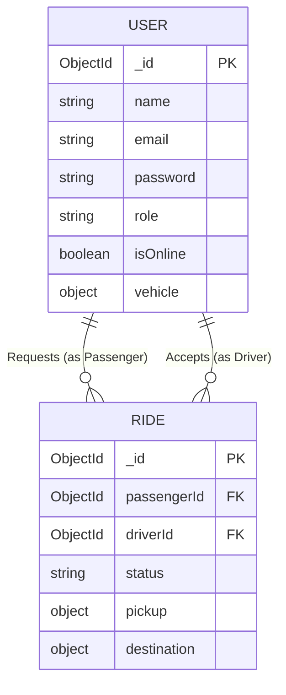

# Campus Mobility Platform - Design Document

## 1. Problem Understanding
Modern large campuses (like universities or tech parks) face challenges in intra-campus last-mile transportation. Passengers often struggle to find available rides (e-rickshaws, shuttles), while drivers lack visibility into passenger demand, leading to inefficiencies. This platform solves the problem by providing a centralized, real-time digital system to connect passengers with available drivers, optimizing routing, saving time, and providing a seamless digital experience.

## 2. System Architecture
The application uses a **Client-Server Architecture** with real-time bi-directional communication.
- **Client (Frontend):** A React.js Single Page Application (SPA) providing separate dashboards for Passengers and Drivers.
- **Server (Backend):** A Node.js API with Express handling HTTP REST requests, and a Socket.IO server handling real-time WebSocket events.
- **Database:** MongoDB, providing a flexible document-based schema suited for geospatial data and dynamic ride states.
- **Real-Time Layer:** Socket.IO pushes state updates (e.g., `ride:requested`, `ride:accepted`) instantly to clients without polling.

## 3. Database Schema

### User Collection
- `_id`: ObjectId
- `name`: String
- `email`: String (Unique)
- `password`: String (Hashed)
- `role`: String (Enum: 'passenger', 'driver')
- `vehicle`: Object (For drivers: `type`, `plateNumber`)
- `isOnline`: Boolean
- `currentLocation`: Object (`lat`, `lng`)
- `averageRating`: Number
- `totalRides`: Number

### Ride Collection
- `_id`: ObjectId
- `passengerId`: ObjectId (Ref: User)
- `driverId`: ObjectId (Ref: User, Nullable)
- `pickup`: Object (`address`, `lat`, `lng`)
- `destination`: Object (`address`, `lat`, `lng`)
- `status`: String (Enum: 'Requested', 'Accepted', 'In Progress', 'Completed', 'Cancelled')
- `fare`: Number
- `rating`: Number
- `feedback`: String

## 4. Entity Relationship Diagram (ERD)

## 5. API Overview

### Authentication endpoints
- `POST /api/auth/register` - Create a new user.
- `POST /api/auth/login` - Authenticate user and return JWT.
- `GET /api/auth/me` - Get current user profile.

### Ride Management endpoints
- `POST /api/rides` - Passenger requests a new ride.
- `GET /api/rides` - Get all rides associated with the user.
- `PUT /api/rides/:id/accept` - Driver accepts a requested ride.
- `PUT /api/rides/:id/status` - Driver updates ride status.
- `PUT /api/rides/:id/rate` - Passenger rates a completed ride.

### Driver Management endpoints
- `PUT /api/drivers/availability` - Toggle driver online/offline status.
- `GET /api/drivers/available` - List currently online drivers.

### WebSocket Events
- `emit('join')` - Client joins their personal room.
- `emit('ride:requested')` - Server broadcasts to `drivers` room.
- `emit('ride:accepted')` - Server notifies the specific passenger.
- `emit('ride:updated')` - Server notifies passenger of status changes.

## 6. Design Decisions

1. **MongoDB over Relational DB:** Chose MongoDB for its flexible schema, making it easy to store nested objects (like `pickup` and `destination` coordinates) and handle future geospatial index expansions smoothly.
2. **Socket.IO for Real-Time:** WebSockets were chosen over HTTP Long-Polling or SSE to ensure sub-second latency for ride requests and acceptances, crucial for a ride-hailing app's perceived performance.
3. **Vanilla CSS with Variables:** Avoided heavy UI frameworks to maintain a clean, custom premium aesthetic. CSS variables ensure consistent theming across the application.
4. **Atomic Updates:** Used MongoDB's `findOneAndUpdate` with query conditions (`status: 'Requested'`) to prevent race conditions when multiple drivers try to accept the same ride simultaneously.
