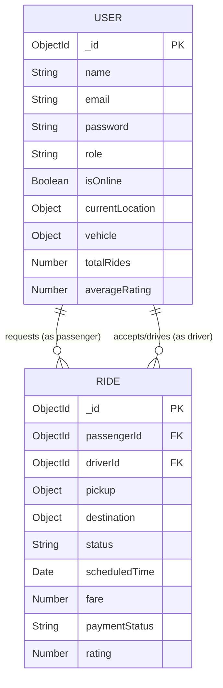

# Deliverable 2: Design Document

**Project:** HopOn (IIT Roorkee Ride Management System)
**Format:** PDF (Exported from Markdown)

---

## 1. Problem Understanding
The IIT Roorkee campus spans a massive area, and students/staff heavily rely on e-rickshaws for internal transit. Currently, the system is informal and unstructured: passengers wait at random spots hoping an empty rickshaw passes by, and drivers wander aimlessly searching for fares. This leads to inefficiency, wasted time, uneven supply-demand matching, and cash-handling issues.

**HopOn** solves this by digitizing the campus mobility network. It provides a centralized, real-time platform where passengers can broadcast their location and destination, and drivers can instantly accept these requests. The system optimizes routes, visualizes live driver locations, manages cashless payments, and provides drivers with data analytics on peak demand hours.

## 2. System Architecture
HopOn follows a classic **Client-Server Architecture** utilizing the MERN stack with event-driven WebSockets.

- **Client Tier (Frontend)**: Built with React.js. It manages the UI, map rendering (React Leaflet), and local state. It communicates with the backend via RESTful HTTP requests (Axios) for CRUD operations and WebSockets (Socket.IO-client) for real-time location streaming.
- **Application Tier (Backend)**: Built with Node.js and Express.js. It acts as the central API gateway, handling business logic, authentication (JWT), payment verification, and routing.
- **Real-Time Tier**: A Socket.IO server runs alongside Express, maintaining persistent connections with clients to broadcast live GPS coordinates and ride status updates instantly.
- **Data Tier (Database)**: MongoDB is used to store unstructured documents (Users, Rides).
- **External APIs**: 
  - *Nominatim (OpenStreetMap)*: For reverse geocoding (coordinates to addresses).
  - *OSRM (Open Source Routing Machine)*: For calculating driving polyline routes.
  - *Razorpay*: For processing UPI payments.

## 3. Database Schema
The database consists of two primary collections in MongoDB:

**User Collection**
Stores both Passenger and Driver profiles.
- `_id`: ObjectId
- `name`: String (Required)
- `email`: String (Required, Unique)
- `password`: String (Hashed)
- `role`: String (Enum: 'passenger', 'driver')
- `isOnline`: Boolean (Driver only, default false)
- `currentLocation`: Object { lat: Number, lng: Number } (Driver only)
- `vehicle`: Object { type: String, plateNumber: String } (Driver only)
- `totalRides`: Number
- `averageRating`: Number

**Ride Collection**
Stores data for individual ride requests and journeys.
- `_id`: ObjectId
- `passengerId`: ObjectId (Ref: User)
- `driverId`: ObjectId (Ref: User)
- `pickup`: Object { address: String, lat: Number, lng: Number }
- `destination`: Object { address: String, lat: Number, lng: Number }
- `status`: String (Enum: 'Requested', 'Accepted', 'In Progress', 'Completed', 'Cancelled')
- `scheduledTime`: Date (Null if instant)
- `fare`: Number
- `paymentStatus`: String (Enum: 'Pending', 'Completed')
- `rating`: Number
- `feedback`: String

## 4. Entity Relationship Diagram (ERD)

## 5. API Overview

### Authentication endpoints
- `POST /api/auth/register`: Register a new user (hash password, return JWT).
- `POST /api/auth/login`: Authenticate user and return JWT.
- `POST /api/auth/google`: Authenticate or register via Google OAuth.
- `GET /api/auth/me`: Retrieve current logged-in user profile.
- `PUT /api/auth/profile`: Update user profile details.

### Ride endpoints
- `POST /api/rides`: Create a new ride request (or multiple for daily schedules).
- `GET /api/rides`: Fetch all relevant rides for the logged-in user.
- `PUT /api/rides/:id/accept`: Driver accepts a requested ride.
- `PUT /api/rides/:id/status`: Update ride status ('In Progress', 'Completed', etc.).
- `PUT /api/rides/:id/rate`: Submit passenger rating and feedback.

### Driver endpoints
- `PUT /api/drivers/availability`: Continuously update driver's GPS location and online status.
- `GET /api/drivers/available`: Fetch a list of all currently online drivers and their locations.

### Payment endpoints
- `POST /api/payments/create-order`: Generate a Razorpay order ID.
- `POST /api/payments/verify`: Validate the Razorpay signature to confirm payment completion.

## 6. Design Decisions
1. **Real-time GPS Tracking via `watchPosition`**: Instead of periodic polling, the application utilizes the browser's native `navigator.geolocation.watchPosition` API. This triggers the frontend to push location updates to the backend *only* when the device actually moves, saving battery and ensuring high accuracy on the passenger's live map.
2. **In-Memory MongoDB for Reproducibility**: To fulfill the rubric requirement that "the solution should be reproducible" without requiring the evaluator to set up a MongoDB Atlas cluster, the backend gracefully falls back to `mongodb-memory-server`. This spins up an isolated, temporary database instance purely in RAM entirely automatically on boot.
3. **Split-Screen Unified Auth**: The traditional multi-page `/login` and `/register` routing was abandoned in favor of a unified landing page. This reduces navigation friction; users can instantly toggle between login and signup via React state without a page reload.
4. **Demand Analytics Bucketing**: The driver dashboard groups historical ride data into 21-hour buckets (5 AM to 1 AM) rather than raw timestamps. This aggregates the data into a visually understandable Bar Chart, allowing drivers to intuitively identify peak demand hours on campus.
